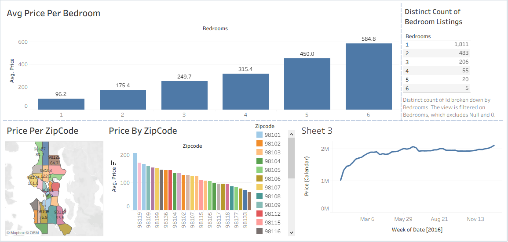

# 🏠 Seattle Airbnb Analysis — Tableau Dashboard Project

This project explores Airbnb listing trends in Seattle using Tableau.  
The dashboard answers key questions about pricing, geographic patterns, bedroom distribution, and temporal price variations.

Dataset pulled from Kaggle → *Seattle Airbnb Open Data*.

---

# 🔗 Navigation

| Section | Link |
|--------|------|
|  Dashboard Preview | [View](#📊-dashboard-preview) |
|  Project Structure | [View](#📁-project-structure) |
|  Key Insights | [View](#key-insights) |
|  Tools Used | [View](#tools-used) |
|  How to Use | [View](#how-to-use) |
|  Dataset Source | [View](#dataset-source) |

---

# 📁 Project Structure

```
Seattle-Airbnb-Tableau-Project/
│
├── data/
│   └── Seattle_Airbnb_Dataset.xlsx
│
├── dashboard/
│   ├── AirBnb_Project.twb
│   └── Seattle_Airbnb_Dashboard.PNG
│
└── README.md
```

---

# 📊 Dashboard Preview

<p align="center">
  
</p>

Dashboard Visuals Include:
- **Average Price per Bedroom**
- **Distinct Bedroom Count Distribution**
- **Price by Zip Code (Bar Chart)**
- **Price per Zip Code (Geo Map)**
- **Price Trend Over Time (Line Chart)**

---

# Key Insights

✔ **Avg price strongly increases with bedroom count.**  
✔ **Zip codes 98109, 98119, and 98121 show the highest average prices.**  
✔ **Listings are highly concentrated in central Seattle neighborhoods.**  
✔ **Bedroom distribution is dominated by 1-bed and 2-bed listings.**  
✔ **Seasonal spikes** appear mid-year (June–August), showing Airbnb demand patterns.  

---

# Tools Used

- Tableau Desktop (for dashboard & visual analytics)  
- Excel/CSV (raw data sources)  
- Geographic Visualization (Mapbox)  
- Data Cleaning & Aggregation  

---

# How to Use

1. Download the Tableau workbook:  
   ```
   dashboard/AirBnb_Project.twb
   ```

2. Open it in **Tableau Desktop / Tableau Public**.

3. Make sure the dataset (`Seattle_Airbnb_Dataset.xlsx`) is in the expected relative path:
   ```
   Seattle_Airbnb_Dataset.xlsx
   ```

4. Explore the interactive visualizations:
   - Hover on map regions  
   - View price trends  
   - Analyze bedrooms & zip code differences  

5. Modify or extend the dashboard based on your analytical needs.

---

# Dataset Source

Kaggle → *Seattle Airbnb Open Data*  
https://www.kaggle.com/datasets/airbnb/seattle

---

# Author

**Bhavishya Pancholi**  
Tableau | Data Visualization | Geospatial Analysis | Airbnb Analytics


